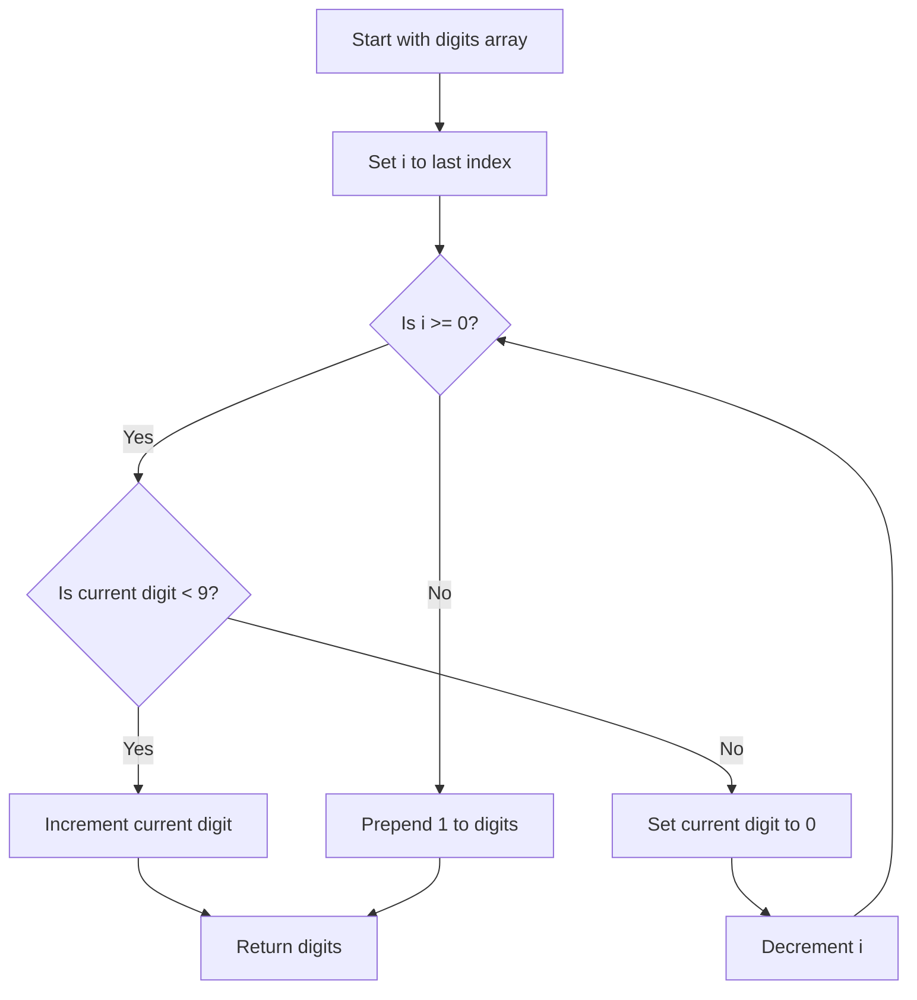

# Plus One - Solution Explanation

## What the Solution Does

The solution processes the `digits` array from right to left, just like manual addition.

1. Start at the last digit.
2. If the current digit is less than `9`, increment it by `1` and return immediately.
   - No further carry is needed.
3. If the current digit is `9`, set it to `0` and continue left because of carry.
4. If the loop ends, every digit was `9` (for example, `[9]` or `[9,9,9]`).
   - Insert `1` at the start and return.
   - Example: `[9,9,9] -> [1,0,0,0]`.

This makes the solution efficient because it exits early for common cases where the last digit is not `9`.

## Algorithm Type

- **Type:** Iterative digit traversal with carry propagation (simulation of elementary addition).
- **Why this fits:** The method mimics manual addition from right to left, propagating carry through trailing `9`s until no carry remains.

## Flowchart

## Time Complexity Choice

- **Time Complexity:** `O(n)` in the worst case, where `n` is the number of digits.
  - Worst case happens when all digits are `9`, so the algorithm touches every element.
  - For many inputs, it returns earlier (for example `[1,2,3]`), but Big-O remains `O(n)`.

- **Space Complexity:** `O(1)` auxiliary space.
  - The algorithm updates the input array in place.
  - The only structural growth is when all digits are `9`, where one extra digit is added to the result.
